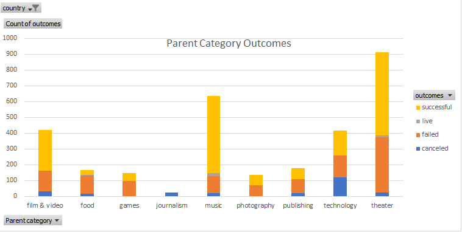
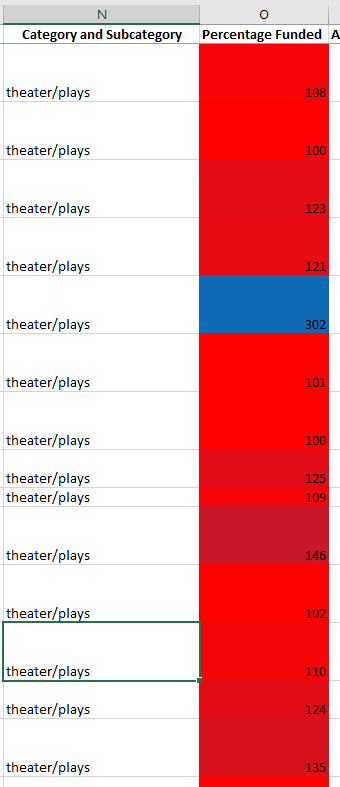

# An Analysis of Kickstarter Campaigns
Performing analysis on Kickstarter data to uncover trends
# Kickstarting with Excel

### Overview of Project
- The objective of this project is to analyze Kickstarter crowdfunding data.

### Purpose
- The purpose of this analysis is to help Louise the playwright, successfully plan her own crowdfunding campaign for her play, ***Fever***. This will be done by analyzing crowdfunding data to identify if there are specific factors that make a project’s campaign successful. 

### Analysis and Challenges
- The Kickstarter crowdfunding data analysis was performed by filtering data sets, applying conditional formatting, calculating measures of central tendency and measures of spread, as well as visualizing trends through line charts. A challenge I encountered during this analysis was not immediately identifying the color gradient change when using **Value Shading** in the “Percentage Funded” column as this feature was applied to a large dataset. To see and appreciate the usefulness of Value Shading, I further filtered data by the Subcategory, “plays” which condensed the dataset. This smaller, filtered data allowed me to see a color gradient change for “Percentage Funded”. 

- The following image shows an overview of the large dataset which was further parsed and used in this analysis: 
- The following image provides an illustration of the distinct color gradient using **value shading** in the "Percentage Funded" column to indicate minimum and maximum values by assigning the colors red and blue: 

### Results

- **What are two conclusions you can draw about the *Outcomes based on Launch Date*?**
  - Two conclusions I can draw about the Theater Outcomes based on Launch Date are: 
    1. May is the best month for a successful campaign.
    2. December is the worst month for a successful campaign.  

- **What can you conclude about the *Outcomes based on Goals*?**
  The conclusion I can make after analyzing Outcomes based on Goals is: smaller, achievable goals such as less than $1,000 were able to be met making the crowdfunding campaign successful.  

- **What are some limitations of this dataset?**
  Limitations of this dataset include the lack of demographic details of the backers and the exclusion of data for the platforms or resources that were used to advertise a project’s Kickstarter campaign; the various social media platforms, websites, email mailing lists, and even printed media like a newspaper can all be used to advertise a project’s Kickstarter campaign. Having data for the medium used to advertise a crowdfunding campaign can determine the best possible advertising platform. Crowdfunding is not a true indicator of the success or failure of a project as there could be other sources of funds for the project besides a Kickstarter crowdfunding campaign. 

- **What are some other possible tables and/or graphs that we could create?**
  Possibilites of other graphs which can be created include a histogram and a treemap. The histogram can be created to show the distribution of data and highlight whether data is skewed to the right or skewed to the left or symmetrical. A treemap can also be used to show proportions within a hierarchy; banners that can be used in a treemap to show outcomes based on launch date include "successful", "failed", and "canceled", while the proportions within each hierarchy can be grouped into the twelve months of the year and the sizing of the proportions will reflect the respective values.

Please store the following Github repository link for your records: https://github.com/stacychandisingh/kickstarter-analysis :smiley:
